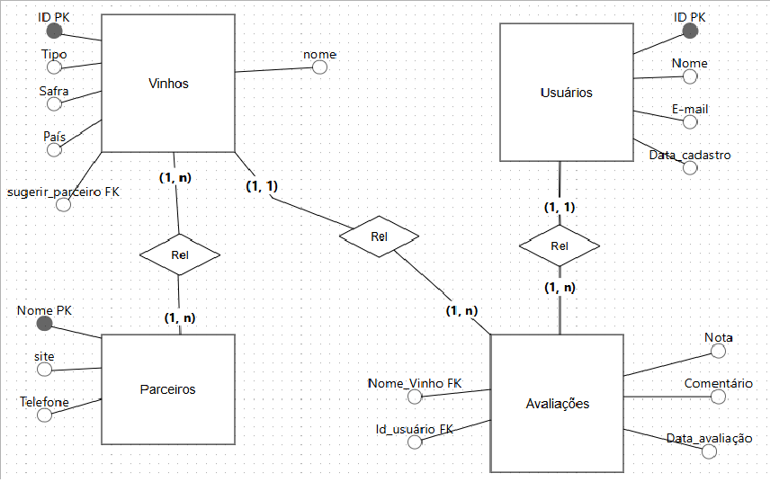

# Clube_do_Vinho
Projeto Integrado Proz Educação
link Canvas:
https://www.canva.com/design/DAGeADUMVL4/-uJagImDXUWZIVNdwa8V-Q/edit

Diagrama Entidade Relacionamento




```
  CREATE TABLE parceiro (
  nome VARCHAR(50) PRIMARY KEY,
  site VARCHAR(100),
  telefone VARCHAR(100)
  );
  
  CREATE TABLE vinho (
  id serial PRIMARY KEY,
  nome VARCHAR(100),
  tipo VARCHAR(30),
  safra INT,
  pais VARCHAR(30),
  sugerir_parceiro VARCHAR(30),
  FOREIGN KEY (sugerir_parceiro) REFERENCES parceiro(nome)
  );
  
  CREATE TABLE usuario (
  id serial PRIMARY KEY,
  nome VARCHAR(100),
  sobrenome VARCHAR(100),
  email VARCHAR(100),
  data_cadastro DATE
  );
  
  CREATE TABLE avaliacao (
  id_usuario INT NOT NULL,
  id_vinho INT NOT NULL,
  nota FLOAT NOT NULL,
  comentario TEXT NOT NULL,
  data_avaliacao date,
  PRIMARY KEY (id_usuario, id_vinho),
  FOREIGN KEY (id_usuario) REFERENCES usuario(id),
  FOREIGN KEY (id_vinho) REFERENCES vinho(id)
  );
  
  INSERT INTO parceiro (nome, site, telefone) VALUES
  ('Evino', 'www.evino.com.br', '+55 (11) 4200-4999'),
  ('Wine', 'www.wine.com.br', '+ 55 (31) 93500-4476'),
  ('Divvino', 'www.divvino.com.br', '+55 (48) 4020 2004'),
  ('Grand Cru', 'www.grandcru.com.br', '+55 (11) 4040 2562');
  
  INSERT INTO vinho (nome, tipo, safra, pais, sugerir_parceiro) VALUES
  ('Concha Y Toro Reservado Cabernet Sauvignon', 'Tinto', 2019, 'Chile', 'Evino'),
  ('Casillero Del Diablo Merlot', 'Tinto', 2014, 'Chile', 'Wine'),
  ('Benjamin', 'Branco', 2018, 'Argentina', 'Divvino'),
  ('Casal Garcia Branco', 'Branco', 2018, 'Portugal', 'Grand Cru');
  
  INSERT INTO usuario (nome, sobrenome, email, data_cadastro) VALUES
  ('Amanda', 'Bazante', 'amanda@gmail.com', '2024-10-12'),
  ('Caio', 'Martins', 'caio@gmail.com', '2024-11-20'),
  ('Pedro', 'Rian', 'pedro@gmail.com', '2024-07-17'),
  ('Wagner', 'Camargo', 'wagner@gamil.com', '2024-10-10');
  
  INSERT INTO avaliacao (id_usuario, id_vinho, nota, comentario, data_avaliacao) VALUES
  (3, 1, 4.6, 'Com notas intensas de frutas escuras e um toque de carvalho, é um vinho encorpado e elegante. Perfeito para acompanhar carnes vermelhas e pratos sofisticados.', '2025-03-18'),
  (1, 3, 4.7, 'O produto é ótimo para quem gosta de um vinho branco suave . É para tomar geladinho! Delícia!', '2025-04-17'),
  (2, 4, 4.5, 'Leve, fresco e com um toque cítrico que combina perfeitamente com dias quentes. Ideal para acompanhar pratos leves ou simplesmente para apreciar sozinho.', '2025-03-01'),
  (1, 2, 4.4, 'Um tinto cheio de personalidade: frutas escuras, toque de madeira e um final gostoso. Fácil de beber, combina demais com aquele churrasco ou jantar caprichado. Ótima pedida!', '2025-01-10');

SELECT * FROM parceiro;
SELECT * from vinho;
SELECT * from usuario;
select * from avaliacao;
```


