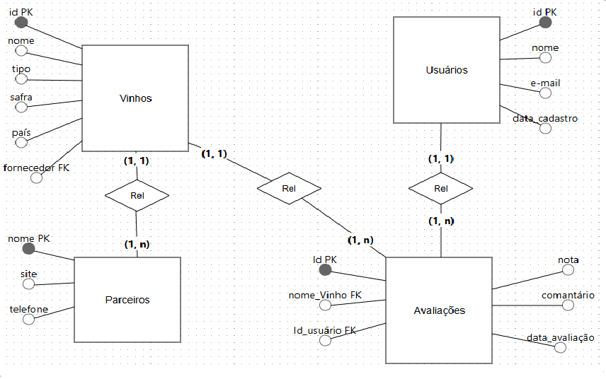

# Clube_do_Vinho
Projeto Integrado Proz Educação
link Canvas:
https://www.canva.com/design/DAGeADUMVL4/-uJagImDXUWZIVNdwa8V-Q/edit

Diagrama Entidade Relacionamento

SQL

  CREATE TABLE parceiro (
  nome VARCHAR(30) PRIMARY KEY,
  site VARCHAR(100),
  telefone INT
  );
  
  CREATE TABLE vinho (
  id serial PRIMARY KEY,
  nome VARCHAR(30),
  tipo VARCHAR(8),
  safra DATE,
  pais VARCHAR(5),
  sugerir_parceiro VARCHAR(30),
  FOREIGN KEY (sugerir_parceiro) REFERENCES parceiro(nome)
  );
  
  CREATE TABLE usuario (
  id serial PRIMARY KEY,
  nome VARCHAR(30),
  sobrenome VARCHAR(30),
  email VARCHAR(100),
  data_cadastro DATE
  );
  
  CREATE TABLE avaliacao (
  id_usuario INT NOT NULL,
  id_vinho INT NOT NULL,
  nota FLOAT NOT NULL,
  comentario TEXT NOT NULL,
  data_avaliacao date,
  PRIMARY KEY (id_usuario, id_vinho),
  FOREIGN KEY (id_usuario) REFERENCES usuario(id),
  FOREIGN KEY (id_vinho) REFERENCES vinho(id)
  );

